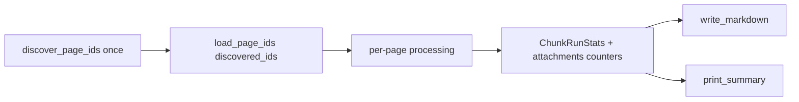

# Ingestion Logging

Документ фиксирует реализованную логику логирования и сводной статистики
для Confluence -> Qdrant ingestion pipeline.

## Связанные файлы

| Файл | Назначение |
|------|------------|
| [`rague/ingestion/confluence_to_qdrant.py`](../rague/ingestion/confluence_to_qdrant.py) | Оркестрация прогона, per-page progress logs, вызов summary и changelog |
| [`rague/ingestion/logging_config.py`](../rague/ingestion/logging_config.py) | Настройка stdlib `logging` для CLI (`rague.ingestion`) |
| [`rague/ingestion/changelog.py`](../rague/ingestion/changelog.py) | `ChunkRunStats`, `IngestionRunReport`, terminal summary, Markdown-отчёт |
| [`rague/sources/confluence/multi_page_loader.py`](../rague/sources/confluence/multi_page_loader.py) | `load_page_ids()` — загрузка по уже найденному списку page IDs |
| [`tests/test_chunk_run_stats.py`](../tests/test_chunk_run_stats.py) | Unit-тесты агрегатов и summary без Confluence/Qdrant |
| [`README.md`](../README.md) | Примеры вывода и `--log-level` / `LOG_LEVEL` |
| [`.env.example`](../.env.example) | `LOG_LEVEL=INFO` |

## Общие требования к логике логирования

### 1. Два канала вывода

Логирование ingestion разделено на два канала с разным назначением:

1. **Progress logs** — через stdlib `logging` (`rague.ingestion`).
   - Per-page прогресс `[N/M]`, предупреждения, ошибки, debug-детали.
   - Уровень управляется `--log-level` или `LOG_LEVEL` (`DEBUG`, `INFO`, `WARNING`, `ERROR`).
   - Настраивается в [`logging_config.py`](../rague/ingestion/logging_config.py).

2. **Terminal summary** — через `print()` в [`IngestionRunReport.print_summary()`](../rague/ingestion/changelog.py).
   - Финальная сводка **всегда** печатается в терминал, даже при `LOG_LEVEL=WARNING` или `ERROR`.
   - Это не logger, а явный terminal output; метод называется `print_summary()`, не `log_summary()`.

3. **Persistent audit** — Markdown changelog в `changelog/`.
   - Пишется после каждого прогона через `write_markdown()`.
   - Содержит детальный audit trail (`added`, `removed`, `failed`, `errors`) и агрегаты.

### 2. Что логировать во время прогона

В [`confluence_to_qdrant.py`](../rague/ingestion/confluence_to_qdrant.py):

| Событие | Уровень | Пример |
|---------|---------|--------|
| Embedder / Qdrant / cutoff готовы | `INFO` | `Embedder ready: model=...` |
| Discovery завершён | `INFO` | `Discovered 87 page(s), scope=...` |
| Страница загружена | `INFO` | `[  1/ 87] page 131304166 'Title' -> 12 chunks, 12 upserted (4.2s)` |
| Пустая страница | `WARNING` | `-> skipped (empty content)` |
| Ошибка страницы | `ERROR` | `-> failed: HTTP 403` |
| Traceback, delete, attachments | `DEBUG` | детали для отладки |

Секреты (`confluence_password`, tokens) в логи **не попадают**.

### 3. Сводная статистика по чанкам

Агрегация в [`ChunkRunStats`](../rague/ingestion/changelog.py):

- `total`, `chars_total`, `by_type`, `per_page_counts`
- min/avg/max чанков на страницу
- **Code fragments** — сумма чанков с `chunk_type in {"code", "code_summary"}` (константа `CODE_CHUNK_TYPES`)
- Типы чанков задаются в [`rague/chunking/markdown.py`](../rague/chunking/markdown.py): `text`, `code`, `code_summary`, `table_row`

`record_page(chunks)` вызывается после split/enrich для каждой успешно обработанной страницы.

### 4. Сводная статистика по attachments

Счётчики в `IngestionRunReport`:

- `attachments_discovered`
- `attachment_samples_saved`
- `attachments_skipped`
- `attachments_failed`
- `attachment_sample_extensions`

Форматирование централизовано:

- `format_attachment_extensions()` — deduplicated, sorted extensions
- `format_attachment_summary()` — одна строка для terminal summary

Attachments **не индексируются** в Qdrant; сохраняется максимум один local sample на расширение (см. [`multi_page_loader.py`](../rague/sources/confluence/multi_page_loader.py)).

### 5. Discovery выполняется один раз

До доработки логирования discovery вызывался дважды: в `run_ingestion()` и внутри `lazy_load()`.

Текущая схема:



- [`discover_page_ids()`](../rague/sources/confluence/multi_page_loader.py) — один раз в начале прогона.
- [`load_page_ids(page_ids)`](../rague/sources/confluence/multi_page_loader.py) — загрузка без повторного discovery.
- [`lazy_load()`](../rague/sources/confluence/multi_page_loader.py) — сохранён для обратной совместимости: `yield from load_page_ids(discover_page_ids())`.

### 6. Финальная terminal summary

`print_summary()` всегда выводит:

```text
Ingestion finished in 312.5s
Pages: discovered=87 loaded=82 skipped=3 failed=2
Chunks: total=412 | per page avg=5.0 min=1 max=24
Chunks by type: code=42, code_summary=12, table_row=8, text=350
Code fragments: total=54 (code=42, code_summary=12)
Attachments: discovered=18, samples_saved=4, skipped=14, failed=0, extensions=pdf, pptx
Qdrant: deleted=380 upserted=412
Changelog written: changelog/2026-06-06_14-30-00_confluence_ingestion.md
```

### 7. Markdown changelog

Секции в [`_render_markdown()`](../rague/ingestion/changelog.py):

- **Run Summary** — время, scope, collection, embedding
- **Metrics** — pages, chunks, points, attachments (кратко)
- **Chunk Summary** — total, per-page stats, by type, code fragments
- **Attachments** — discovered/saved/skipped/failed/extensions
- **What Worked / Did Not Work / Added / Removed / Errors** — audit trail

Списки `added`/`removed` дублируют краткие progress-логи намеренно: live-наблюдение в терминале vs. постфактум audit в changelog.

## Конфигурация

```bash
# .env
LOG_LEVEL=INFO

# CLI
python -m rague.ingestion.confluence_to_qdrant --log-level DEBUG
```

| Уровень | Per-page progress | Errors | Terminal summary |
|---------|-------------------|--------|------------------|
| `DEBUG` | да | да + traceback | да |
| `INFO` | да | да | да |
| `WARNING` | нет | да | да |
| `ERROR` | нет | да | да |

## Что сознательно не входит в MVP

- Progress bar (tqdm/rich)
- Запись логов в файл (`--log-file`)
- Per-page code/attachment count в `INFO` (только в финальной сводке)
- Ограничение размера audit-списков в changelog (`max_report_items`)

## Замечание по устаревшей документации

В [`implementation_considerations.md`](implementation_considerations.md) (раздел «Большие Confluence Spaces») по-прежнему описана проблема **двойного discovery** как открытая задача («Что Улучшить Позже»). На момент реализации ingestion logging эта проблема **уже решена** через `load_page_ids()` и использование `discovered_ids` в [`confluence_to_qdrant.py`](../rague/ingestion/confluence_to_qdrant.py).

При следующем обновлении design-доков стоит:

1. Пометить double discovery как resolved.
2. Сослаться на этот документ и [`multi_page_loader.py`](../rague/sources/confluence/multi_page_loader.py).
3. Оставить в `implementation_considerations.md` только оставшиеся риски больших spaces (rate limits, attachment volume, changelog size).

## Тесты

Покрытие в [`tests/test_chunk_run_stats.py`](../tests/test_chunk_run_stats.py):

- агрегация `ChunkRunStats` по типам и code fragments
- `format_attachment_extensions()` / `format_attachment_summary()`
- `print_summary()` с code fragments и attachments
- regression: `Code fragments: total=0` при отсутствии code-чанков
- рендер `Chunk Summary` и `Attachments` в Markdown
